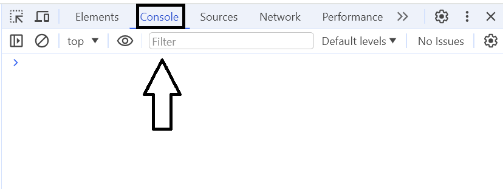
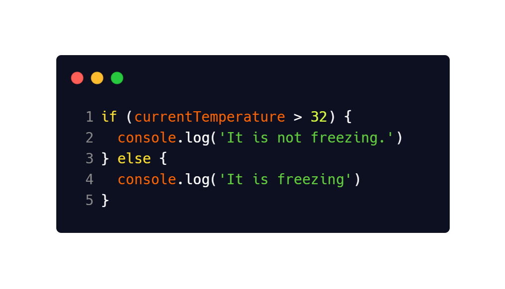
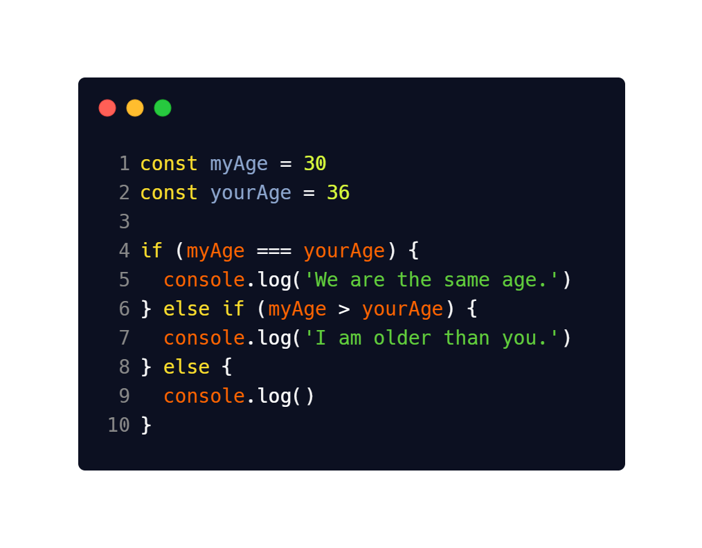

# Javascript Conditionals

---

## Description 📄

Now we will practice conditionals in Javascript. Conditionals are fundamental building blocks in programming that allow you to make decisions based on certain conditions. 

Note: All work in this lab will be done in the `script.js` file. The HTML exists only to link the Javascript file so we can use the browser console. 

---

## Codespaces Guidance 📄
Should you need guidance on how to fork, open, edit, and maintain your codespaces, please use the link below by right clicking and opening in a new tab.  

[GitHub Codespaces Guidance](https://gist.github.com/JohnWP8253/4fff80f43d07a04ee3f1514c0a1d354a)

---

## ToDo list ✅
**Attention**: When you complete a task, put an `x` in the middle of the brackets to mark it off your ToDo list.

[ ]  Open the browser console and navigate to the console. It should look like this:

[ ] Let's create a variable called `currentTemperature` and set the value to 40.

[ ] Let's create our first conditional to check if the `currentTemperature` is freezing. Write the following and then refresh the browser and check the console. You should see that it is not freezing. Now change the temperature to below 32 and refresh the page.

[ ] Now to try something a little trickier. Let's create a conditional to compare the ages of two different people. Notice how this example makes use of the `else if`. This allows us to make check if one person is older, younger, or the same age as another person. There is no limit to how many `else if` statements you can use.

   [ ] Also notice that the last `console.log()` is empty. Enter in the logical statement into the method. 

[ ] Try this one yourself. Create a variable `isLoggedIn` and set it to `true` (Boolean, not String) to represent yourself being logged into some account you have. Create an `if` statement that welcomes you back if you are logged in, or asks you to log in if you are not logged in. Once you have it working change the value of `isLoggedIn` to `false` and check your results.

---

### Solution codebase 👀
🛑 **Only use this as a reference** 🛑

💾 **Not something to copy and paste** 💾

**Note:**  This lab references a solution file located [here](https://github.com/HackerUSA-CE/sdai-ic-d6-conditionals/tree/solution)
